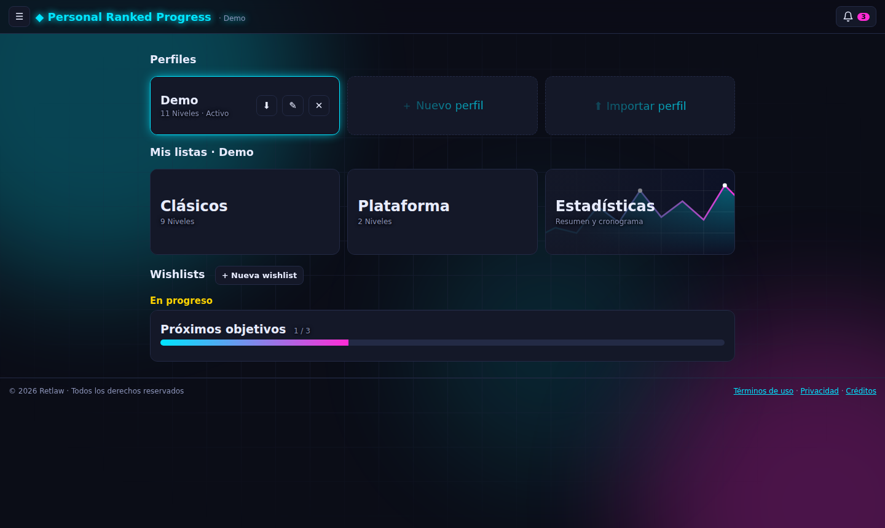
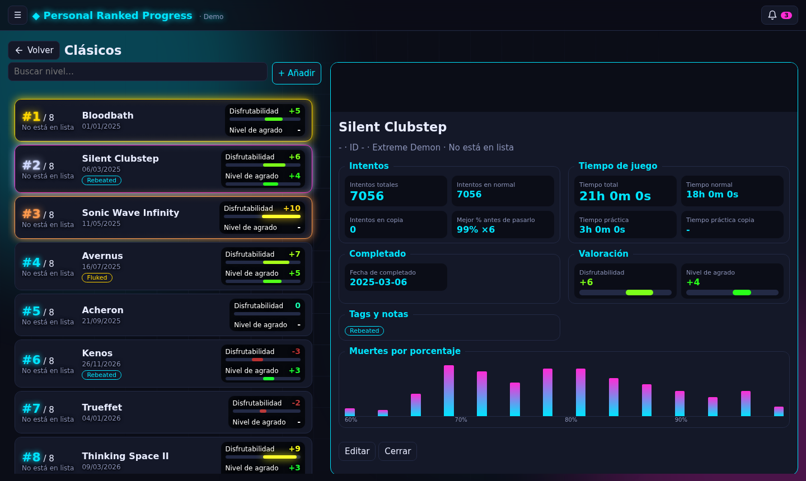
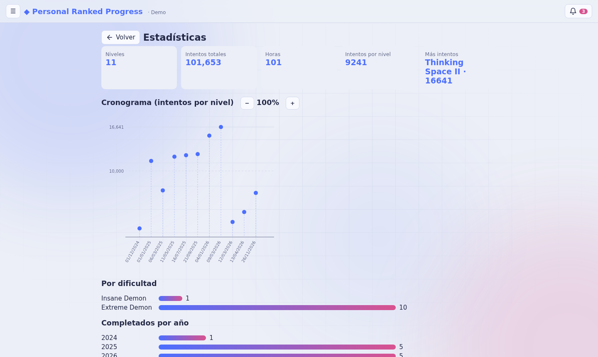

# Personal Ranked Progress

Aplicación web para llevar el seguimiento de los niveles más difíciles de **Geometry Dash** que has completado: tu top personal, intentos, tiempo de juego, muertes por porcentaje, valoraciones y una línea de tiempo de tus completions. Pensada para reemplazar una hoja de Excel por algo más visual e interactivo.

**Ver la aplicación:** <https://wal-014.github.io/Personal-Progress-List/>

> Proyecto personal. No está afiliado a RobTop Games, a Geometry Dash ni a la AREDL.

## Capturas

| Inicio | Lista y detalle | Estadísticas (tema claro) |
|---|---|---|
|  |  |  |


## Características

- **Perfiles**: cada perfil tiene sus propias listas, wishlists y tags. Se pueden crear, renombrar, borrar, exportar e importar.
- **Listas de niveles** (Clásicos y Plataforma) con tarjetas arrastrables para ordenar tu top personal (`#12 / 90`), puesto en la AREDL y miniatura del nivel de fondo.
- **Panel de información** al lado de la lista: intentos (en normal y en copia), tiempos, fecha, video de YouTube con su miniatura, valoración de −10 a 10, tags, notas e histograma de muertes por porcentaje.
- **Búsqueda** que filtra mientras escribes y mantiene el nivel seleccionado al borrar el texto.
- **Wishlists** con estados *Sin empezar / En progreso / Completado*, barra de progreso por lista y envío de los niveles completados a tus listas.
- **Estadísticas**: totales, cronograma de intentos con zoom, distribución por dificultad y por año.
- **Tags** personalizables con color.
- **Temas** (oscuro, claro y synth) con fondo animado, e **idiomas** español e inglés.
- **PWA**: se puede instalar en el celular o el escritorio y abrir sin conexión.
- **Avisos** (campana) para niveles sin colocar o sin ID.

## Tecnologías

HTML, CSS y JavaScript sin framework ni paso de compilación. Única dependencia externa: [SortableJS](https://sortablejs.github.io/Sortable/) (cargada por CDN) para arrastrar tarjetas.

Servicios externos que consulta el navegador:

| Servicio | Para qué |
|---|---|
| [AREDL API](https://api.aredl.net/v2/docs) | Posición en la lista, ID y publisher de los niveles |
| [Level Thumbnails](https://levelthumbs.prevter.me/swagger/) | Miniatura de cada nivel (`/thumbnail/{id}`) |
| YouTube | Miniatura de los videos (`img.youtube.com`) |

Ninguno requiere clave de API.

## Estructura del proyecto

```
├── index.html            Página única; carga los scripts en orden
├── css/styles.css        Estilos y temas (variables CSS)
├── js/
│   ├── config.js         Constantes (dificultades, URL de la API, iconos)
│   ├── i18n.js           Traducciones ES / EN
│   ├── utils.js          Funciones auxiliares puras
│   ├── state.js          Perfiles, localStorage y estado de la interfaz
│   ├── api.js            Integración con la AREDL
│   ├── components/       Pantallas: levels, wishlists, stats, home, dialogs
│   ├── render.js         Dibuja la aplicación completa
│   ├── events.js         Clics, formularios, teclado (acciones por data-act)
│   └── main.js           Punto de entrada
├── data/demo-data.js     Perfil de demostración (datos ficticios)
├── manifest.json, sw.js  PWA (instalación y modo sin conexión)
└── iniciar.bat / .command  Atajos para abrir la app en local
```

Los scripts son clásicos (no módulos ES) para que la página también funcione abriendo `index.html` directamente; por eso el orden de carga en `index.html` importa.

## Ejecutar en local

Sirve la carpeta con cualquier servidor estático, por ejemplo `python -m http.server 8000`, y abre <http://localhost:8000>. En Windows también puedes usar `iniciar.bat`.

## Datos y privacidad

- **No hay backend ni cuentas.** Los perfiles se guardan en el `localStorage` del navegador de cada persona y no se envían a ningún servidor propio.
- Los datos solo salen del navegador si **exportas** un perfil (botón ⬇ de su tarjeta en Inicio). Para llevarlo a otro dispositivo: exportar y luego **Importar perfil**.
- El perfil de demostración (`data/demo-data.js`) contiene datos ficticios.

## Créditos

- Posiciones y publishers: [All Rated Extreme Demons List](https://aredl.net).
- Miniaturas de niveles: [Level Thumbnails](https://levelthumbs.prevter.me).
- Geometry Dash © RobTop Games.

## Licencia

Todos los derechos reservados. El código se publica para consulta; consulta [`LICENSE`](LICENSE).
